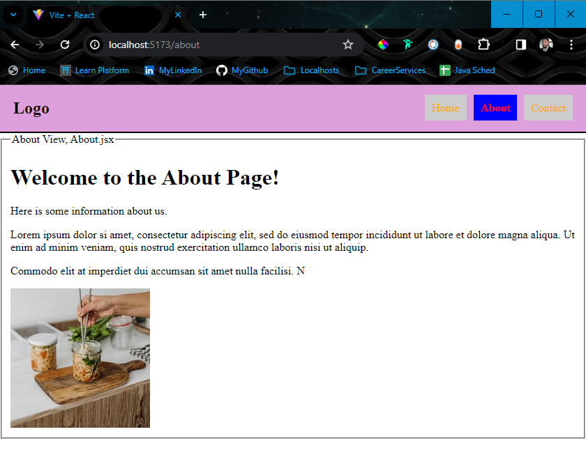
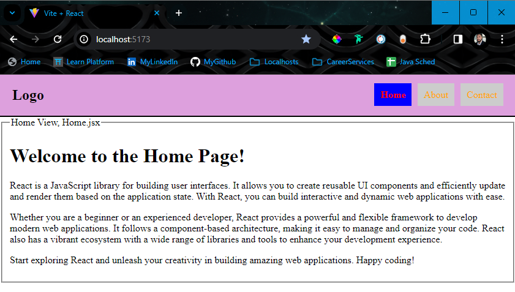

# Navbar Project
This project is a simple React application that uses Vite for building and development. It demonstrates the use of React Router for navigation and includes three views: Home, About, and Contact.

## Table of Contents
- [Navbar Project](#navbar-project)
- [Why did I want to make a Navbar?](#why-did-i-want-to-make-a-navbar)
- [Project Preview](#project-preview)
- [Getting Started](#getting-started)
- [Challenges](#challenges)
- [Things I Learned](#things-i-learned)

## Why did I want to make a Navbar?
I set out to do this because I wanted to learn how to make a navbar that would be responsive and also informativ to the user. I will use these new learnings in my future projects.

## Project Preview
_This project was focused on functionality, so the styling is minimal._

Here you can see the Home and About views of the application as the user navigates between them. The active link is highlighted in the navigation bar.





## Getting Started
Follow these steps to get the project up and running on your local machine:

1. **Clone the repository:**

    ```sh
    git clone https://github.com/jsandoval1/React.git
    ```

2. **Navigate to the React directory:**

    ```sh
    cd React
    ```

3. **Navigate to the navbar directory:**

    ```sh
    cd navbar
    ```

4. **Install the dependencies, which include the React Router library:**

    ```sh
    npm install react-router-dom
    ```

5. **Start the development server:**

    ```sh
    npm run dev
    ```

After following these steps, visit [http://localhost:5173](http://localhost:5173) in your browser to see the application.

## Challenge
During the development of this project, I faced a challenge:

**Navigating with NavLink:** I had trouble getting the `NavLink` component to work properly. I was able to get the links to work, but the active link was not being highlighted. I was able to resolve this issue by using the NavLink component from `react-router-dom` instead of the `Link` component.

## Things I Learned
This project was a great learning experience. Here are a few things I learned:

1. **NavLink Vs. Link:** I learned that the `NavLink` component from `react-router-dom` is used to create navigation links. It is similar to the `Link` component, but it has the added benefit of being able to highlight the active link. This is done by adding the `activeClassName` prop to the `NavLink` component. Then using CSS to style the active link.
2. **Markdown:** I learned how to use Markdown to create a README file. I learned how to add images, links, and code blocks to the README file. You're reading it right now!